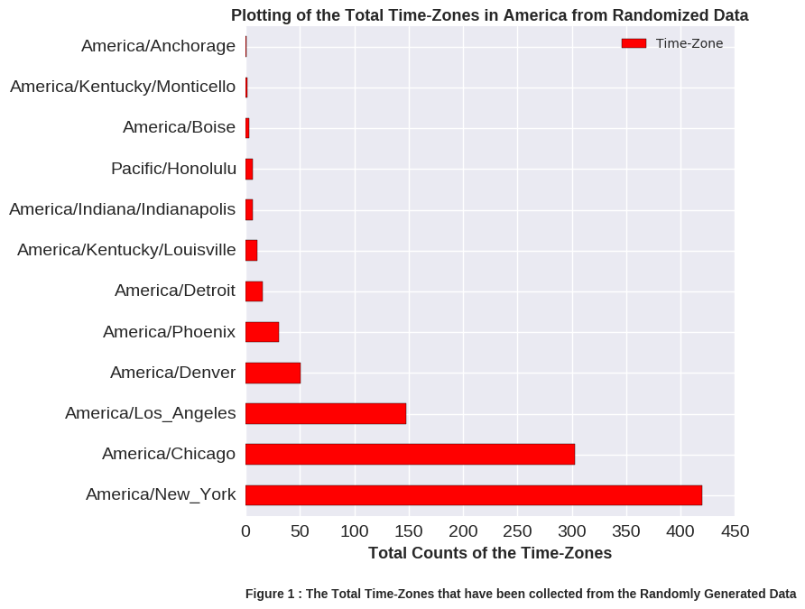

Hi Achilles, your plots are extremely easy to understand. Great visuals!

For the first one, 'Plotting of the Total Time-Zones in America for Randomized Data': the font sizes, color scheme, axis labels, and title give the viewer a great summary of what you're plotting. While the legend is nice, I don't think it's necessary because you are only plotting one data type. I also like the background grid you decided to include because I can easily quantify the time zone counts. My only real piece of feedback here is that I am not quite sure what it is you are counting. I know the assignment was to plot anything you want, so this count is fine, just something to think about for the future.

The 3D plot of randomly generated data is also easy to read. My two pieces of feedback for this plot would be: 1) I'm not sure what the teal bars are doing in each of the separate bar graphs and 2) the gray background adds a layer of complexity that doesn't need to be there. I think if the background were white, it would look cleaner. Otherwise, the color differentiation between each bar graph makes for a visually appealing plot.

Overall, I think you have a knack for putting together plots! Since you generated random data for both, I might consider thinking about under what circumstances you would use different plot styles. With randomly generated data, you don't really have to do this, but if you had to plot complex data with many several attributes, it may take more time to what makes the most sense for the data.
